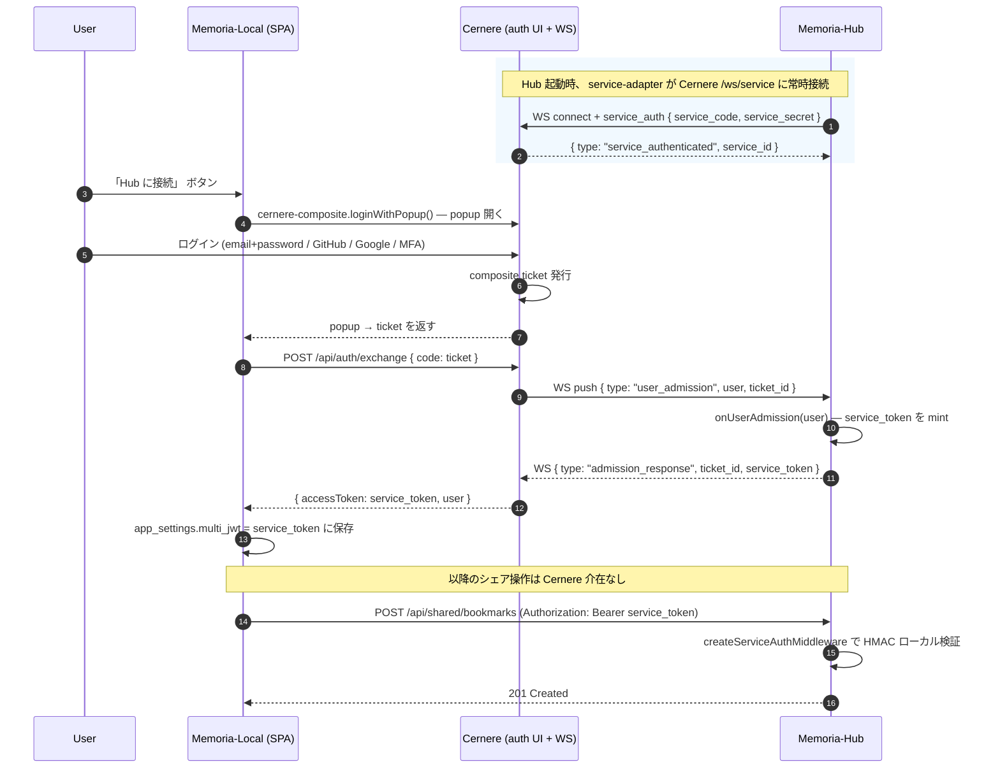

# Memoria Multi-Server (Memoria Hub)

[設計書](../../docs/multi-server-architecture.md)

`server/multi/` は **マルチサーバ専用** のコード。 ローカルサーバ (`server/index.js`) からは独立した別 Node プロセスとして起動する。

## 構成

```
server/multi/
├── index.js               # Hono entry — service-adapter middleware + /api/shared/*
├── cernere-bridge.js      # CernereServiceAdapter で /ws/service に常時接続
├── db.js                  # Postgres adapter (pg)
├── migrate.js             # SQL マイグレーション runner
├── package.json           # ローカルとは別 deps (pg, hono, @ludiars/cernere-service-adapter, ws)
├── .env.example           # 設定テンプレート (rev3)
└── migrations/
    ├── 001_init.sql
    ├── 002_implementation_notes.sql
    ├── 004_work_locations.sql
    └── 005_workplace_presence.sql
```

## 認証モデル (rev3 — service-adapter 準拠)

Cernere の設計思想に従い、 **Hub は Cernere の `/auth` 一族にしか触らない**。

```
[Cernere]                         [Memoria-Hub]                        [Memoria-Local SPA]
  /auth (REST + WS)                  cernere-bridge                      cernere-composite
  ↓                                  ↓                                   ↓
  ・ユーザログイン UI                  ・/ws/service に常時接続              ・loginWithPopup() で
  ・/api/auth/login                  ・onUserAdmission(user) で              Cernere ログイン UI
    /api/auth/register                 service_token を mint                を popup 表示
    /api/auth/exchange               ・onUserRevoke(userId) で              ・終わったら
  ・user 個人情報の単一情報源           revoked set に追加                    accessToken を取得
                                     ・createServiceAuthMiddleware で
                                       service_token をローカル検証
```

**重要点**:
- Hub は Cernere に毎リクエスト問い合わせない (id-cache パターン)
- Hub は user の個人データを保管しない (Cernere が単一情報源)
- service_token の発行は admission のタイミングのみ (15 分の TTL)
- 旧 OAuth Authorization Code + PKCE / password grant 経路は撤去

## セットアップ

```bash
cp .env.example .env
# 編集して Postgres / CERNERE_* / SERVICE_JWT_SECRET を設定

npm install              # @ludiars/cernere-service-adapter は file:link で参照
npm run migrate          # 001_init.sql 等を適用
npm run dev              # http://localhost:5280
```

`@ludiars/cernere-service-adapter` はローカル dev では `file:../../../Cernere/packages/service-adapter` 経由で取得 (Cernere ワークスペースが同 PC にある前提)。 production では GitHub Packages から pull する。

## エンドポイント

| Method | Path | 認証 | 説明 |
| --- | --- | --- | --- |
| GET | `/healthz` | – | liveness |
| GET | `/api/me` | service_token | 自分のユーザ情報 (id / displayName / role) |
| GET | `/api/shared/bookmarks` | – | 公開ブクマ一覧 (cursor: `before=<shared_at>`) |
| POST | `/api/shared/bookmarks` | service_token | 自分の bookmark を共有 |
| DELETE | `/api/shared/bookmarks/:id` | service_token | 自分のシェア取り下げ。 admin/mod は他人も |
| GET | `/api/shared/digs` | – | 公開 dig session 一覧 |
| POST | `/api/shared/digs` | service_token | dig session を共有 |
| DELETE | `/api/shared/digs/:id` | service_token | 取り下げ |
| GET | `/api/shared/dictionary` | – | 公開辞書 (`q=` で部分一致) |
| POST | `/api/shared/dictionary` | service_token | 辞書エントリを共有 |
| DELETE | `/api/shared/dictionary/:id` | service_token | 取り下げ |
| GET | `/api/shared/implementation-notes` | – | 実装自慢 一覧 |
| POST | `/api/shared/implementation-notes` | service_token | 実装自慢を共有 |
| DELETE | `/api/shared/implementation-notes/:id` | service_token | 取り下げ |
| GET | `/api/shared/work-locations` | – | 作業場所一覧 |
| POST | `/api/shared/work-locations` | service_token | 作業場所を共有 |
| DELETE | `/api/shared/work-locations/:id` | service_token | 取り下げ |
| POST | `/api/shared/workplace-presence` | service_token | enter / leave |
| GET | `/api/shared/workplace-presence(/current)` | service_token | 直近 / 現在 |
| POST | `/api/shared/moderation/(hide\|unhide)` | service_token (mod/admin) | モデレーション |
| GET | `/api/shared/moderation/(hidden\|log)` | service_token (mod/admin) | モデレーション履歴 |

シェア・取り下げは `share_log` に監査記録を書く。

## 認証フロー (詳細)



`service_token` は Hub 自身が発行する HS256 JWT (TTL 15 分)。 ローカル検証なので Cernere に毎リクエスト問い合わせない。 期限切れたら再ログイン。

## CORS

`MEMORIA_HUB_ALLOWED_ORIGINS` (CSV) に列挙したオリジンのみ。 未設定だと `/api/*` は cross-origin から呼べない。

## デプロイ

`docker-compose.yml` で Postgres + Hub を 1 コマンド起動。

```bash
cd server/multi
cp .env.example .env
# 編集 — CERNERE_*, SERVICE_JWT_SECRET, POSTGRES_PASSWORD は最低限変更すること

docker compose up -d --build
docker compose logs -f hub          # マイグレーション + 起動ログ + cernere-bridge connect
curl -fsS http://localhost:5280/healthz
```

ストレージは名前付きボリューム `memoria-hub-pg` に永続化。 バックアップは `pg_dump`:

```bash
docker compose exec postgres pg_dump -U memoria memoria_hub > backup.sql
```

## Cernere 側のセットアップ

Cernere 側で Hub を `managed_project` として登録する必要がある。 詳細は Cernere 側のドキュメント (admin UI または `managed_projects` テーブルへの直接 INSERT) を参照。

最低限の登録項目:
- `client_id` = `memoria-hub` (= `CERNERE_SERVICE_CODE`)
- `client_secret` = ランダム文字列 (= `CERNERE_SERVICE_SECRET`)
- `is_active` = true

ローカル開発:
1. Cernere standalone-dev を立てる:
   ```bash
   cd E:/Document/Ars/Cernere
   docker compose -f docker-compose.yaml -f docker-compose.standalone.yaml --profile dev up -d
   ```
2. Cernere admin で memoria-hub を登録 (or `managed_projects` に手動 INSERT)
3. その client_secret を `CERNERE_SERVICE_SECRET` に書き込む
4. Memoria-Hub を起動 (`npm run dev`)

### TLS / リバースプロキシ

Hub は HTTPS を実装しない。 本番では Caddy / nginx / Cloudflare Tunnel 等で TLS 終端し 127.0.0.1:5280 にプロキシする。

```caddy
hub.memoria.example.com {
  reverse_proxy 127.0.0.1:5280
  encode zstd gzip
}
```

`MEMORIA_HUB_ALLOWED_ORIGINS` に Memoria ローカルの公開オリジンを列挙すること (例 `https://memoria.example.com`)。

## 進捗

- **Phase 0**: ✅ db façade + core/local/multi seam (PR #40)
- **Phase 1**: ✅ ローカル SQLite に共有メタカラム追加 + Postgres 初期スキーマ (PR #35)
- **Phase 2**: ✅ MVP — Cernere SSO scaffold + /api/shared/* (PR #41)
- **Phase 3**: ✅ 📤 ローカル UI からの share button (PR #42)
- **Phase 4**: ✅ 🌐 ローカル UI からの multi タブ + proxy (PR #43)
- **Phase 5**: ✅ 📥 multi → ローカル ダウンロード (PR #44)
- **Phase 6**: ✅ モデレーション (admin/mod) (PR #46)
- **Phase 7**: ✅ docker-compose stack + 登録ランブック
- **Phase 8 (rev3)**: 🚧 OAuth PKCE 撤去 → service-adapter / id-cache パターン
