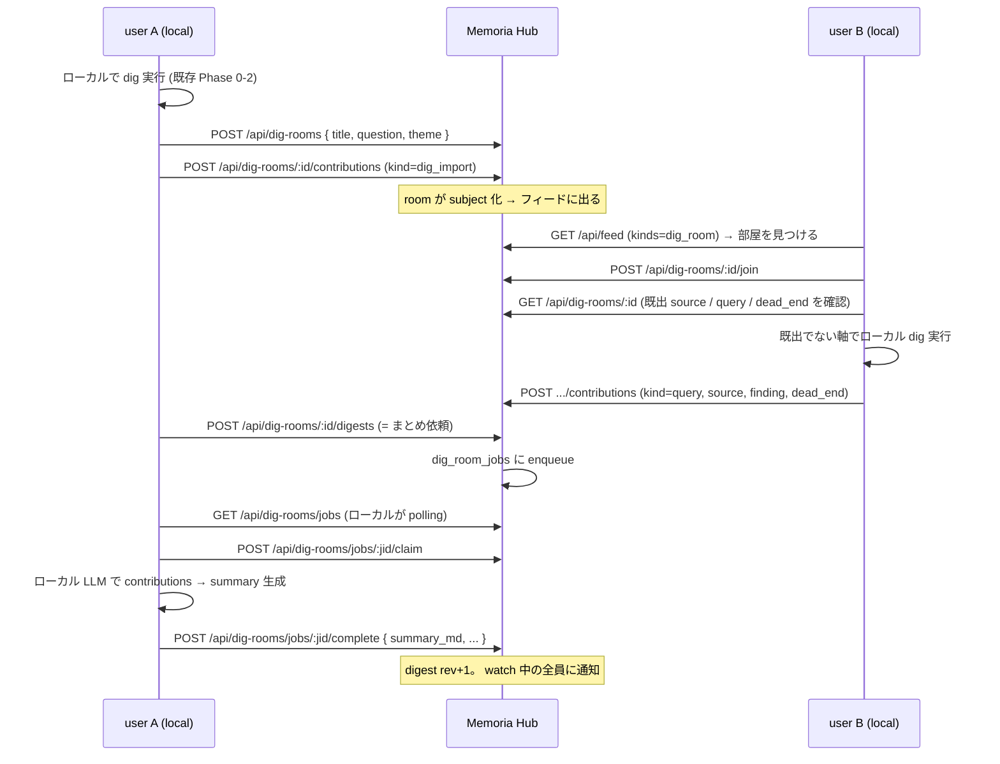

# hub-dig-rooms — みんなでディグる (共同 dig)

> 1 人の deep research を **複数人で掘り進める**ための設計。
> 関連:
> - [`dig.md`](./dig.md) — 個人の dig セッション (Phase 0 SERP → Phase 1 preview → Phase 2 deep)
> - [`hub-social.md`](./hub-social.md) — room / digest は subject 化され、 コメント・いいねが付く
> - schema: [`../data/hub-social.md`](../data/hub-social.md) / API: [`../interface/hub-social.md`](../interface/hub-social.md)

## 1. 何を解決するか

現状の [`dig_sessions`](../data/dig.md#dig_sessions) は **1 ユーザ 1 セッションの
スナップショット**。 Hub にシェアできるが、 出るのは `query` + Phase 2 の
`result_json` だけで、 受け取った側は **読むことしかできない**。

やりたいのは「みんなでディグれる」 =

- 同じテーマを複数人が別の角度から掘る (検索軸を分担する)
- 誰かが見つけた source を全員が見られる
- 「これは違った」 「ここが分かった」 が蓄積する
- 掘った結果が **1 本のまとめ**に収束していく
- **何が既に掘られたか**が分かる (同じ URL を 3 人が別々に読む無駄を消す)

これは「セッションを共有する」 のではなく **「部屋 (room) を共有する」** モデル。

## 2. モデル

```
dig_rooms ─┬─ dig_room_members    (誰が参加しているか)
           ├─ dig_contributions   (append-only の書き込み: 検索軸 / source / 発見 / 疑問)
           ├─ dig_room_digests    (rev 付きの収束まとめ)
           └─ dig_room_jobs       (まとめ生成の依頼キュー)
```

### 2.1 `dig_rooms`

| 概念 | 内容 |
|---|---|
| `id` | UUID (subject key になる) |
| `title` | 部屋の題 (「Vulkan の descriptor indexing 実装事情」 等) |
| `question` | **掘る問い**。 部屋の存在理由を 1 文で。 これがブレると部屋が発散する |
| `theme` | 既存 `dig_sessions.theme` と同じ軸文字列 (ローカル dig と束ねる) |
| `state` | `open` → `digesting` → `converged` → `archived` |
| `created_by` / `created_at` / `updated_at` | |

- `converged` = 「もう掘らなくていい」 と誰かが宣言した状態。 書き込みは
  引き続き可 (再オープンは state を `open` に戻すだけ)
- `archived` = 読み取り専用

### 2.2 `dig_contributions` — append-only の書き込み

**編集も削除もしない**。 間違いは「取り消し contribution」 で上書きする
(掘る過程そのものが情報なので、 履歴を消さない)。

| `kind` | payload の中身 | 意味 |
|---|---|---|
| `query` | `{ query, engine?, rationale }` | 「この軸で検索してみる」 の宣言 + 実行結果件数 |
| `source` | `{ url, title, why, quality: 'primary'\|'secondary'\|'noise' }` | 見つけた資料。 `why` (なぜ重要か) は必須 |
| `finding` | `{ claim, confidence, sourceRefs[] }` | 「〜だと分かった」。 根拠 source への参照必須 |
| `question` | `{ text, resolvedBy? }` | 未解決の疑問。 後から `finding` が解決する |
| `dead_end` | `{ text, sourceRefs[] }` | 「この方向は違った」。 **他人の無駄打ちを消す最重要種別** |
| `dig_import` | `{ localDigId, query, result }` | 自分のローカル dig session の Phase 2 結果を持ち込む |
| `bookmark_ref` / `note_ref` | `{ subjectKey }` | 既に共有済のブクマ / ノートを部屋に結びつける |
| `retract` | `{ targetContributionId, reason }` | 上の取り消し |

- `source` は投稿時に **canonical URL 正規化** ([`hub-social.md`](./hub-social.md) §3.2) を
  かけ、 room 内で既出なら「既出 (誰がいつ出した)」 を返して重複投稿を防ぐ
- `finding` の `sourceRefs` は同 room 内の `source` contribution id を指す。
  根拠なし主張を構造的に作れないようにする

### 2.3 `dig_room_digests` — 収束まとめ

| 概念 | 内容 |
|---|---|
| `rev` | 1 から連番。 **append-only** |
| `summary_md` | 現時点の答え (問い `question` に対する回答の形で書く) |
| `sources_json` | 採用した source の一覧 (url + role) |
| `open_questions_json` | 未解決の `question` |
| `dead_ends_json` | 掘っても無駄だった方向 |
| `metrics_json` | `{ sourceCount, newSourceSinceLastRev, findingCount, openQuestionCount, contributorCount }` |
| `generated_by` | 生成したユーザ / モデル |

**掘り尽くし度**は `metrics_json.newSourceSinceLastRev` の推移で見る。
rev が進んでも新規 source が増えなくなったら収束。 これを UI に出すと
「まだ掘るか / もういいか」 を全員で判断できる。

## 3. 進行フロー



## 4. 「無駄打ちを消す」 機構

共同で掘るときのいちばんの損失は **同じところを別々に掘ること**。
部屋を開いた時点で以下を必ず見せる。

- **既出 source** — canonical URL で dedup した一覧 (quality 別)
- **既出 query** — 誰がどの軸で検索したか。 engine 込み
- **dead_end** — 掘って外れた方向。 これを最上部に出す
- **open_questions** — 空いている担当。 「ここ誰も見てない」 が分かる

さらに投稿時のガード:

- `source` 投稿が既出 URL → `409 { error: 'duplicate_source', existing }` で
  「既出です (誰がいつ)」 を返す。 強制投稿するなら `?force=1` (別の観点で
  同じ資料を読むこと自体は有効なので禁止はしない)
- `query` 投稿が既出クエリと高類似 (正規化 + 語集合の Jaccard ≥ 0.8) →
  警告付きで通す

## 5. まとめ生成をどこで回すか

digest 生成には LLM が要る。 Hub に LLM creds を置きたくない
(multi-hub.md §8 / hub-aggregation.md §6 と同方針) ので 3 案。

主目的 = 「まとめが確実に出る / creds と本文を Hub に増やさない」。

### A. Hub が自分の LLM を叩く

| 指標 | 値 |
|---|---|
| AI 学習量 | ★★☆☆☆ |
| 作業コスト | 小 — Hub に LLM クライアントを 1 本 |
| 目的達成度 | ★★★★★ — 誰もオンラインでなくても出る |
| 主目的一致度 | ★★☆☆☆ — Hub に API key が増える。 拠点管理者が LLM 費用も負う |

### B. job queue をローカルが claim (pull 型)

| 指標 | 値 |
|---|---|
| AI 学習量 | ★★★★☆ — job queue / claim / lease / 再実行 |
| 作業コスト | 中 — `dig_room_jobs` + ローカル polling worker |
| 目的達成度 | ★★★★☆ — 誰かのローカルが起きていれば出る。 全員オフラインなら待つ |
| 主目的一致度 | ★★★★★ — creds は各自のローカルのまま。 既存 LLM 設定をそのまま使える |

### C. 依頼した本人のローカルが同期的に生成して push

| 指標 | 値 |
|---|---|
| AI 学習量 | ★★☆☆☆ |
| 作業コスト | 小 |
| 目的達成度 | ★★★☆☆ — 依頼者に LLM が無い / 遅いと詰まる。 自動 (定期) 生成ができない |
| 主目的一致度 | ★★★★★ |

### 推奨: **B (job claim)**。 C は B の退化形として同経路で扱う

- `POST /api/dig-rooms/:id/digests` は **job を作るだけ** (`202 { jobId }`)
- ローカルは Multi 接続中 60 秒ごとに `GET /api/dig-rooms/jobs` を polling。
  自分がメンバーの room の job を `claim` (lease 5 分、 期限切れで再割当)
- 依頼者のローカルが即 claim できたなら実質 C になる。 別経路にしない
- Hub 側 LLM (案 A) は **将来の任意設定**として空けておく (`digest_worker=hub` 設定)。
  実装しないが、 job テーブルの `claimed_by` に `hub` を入れられる形にしておく

## 6. ローカルとの往復

- **持ち込み**: ローカル dig session → `kind=dig_import` contribution。
  ローカル行は残り、 `dig_sessions.shared_room_id` に room を記録
- **持ち帰り**: `POST /api/dig-rooms/:id/import-local` で room の最新 digest を
  ローカル `dig_sessions` に 1 行として落とす (`owner_user_id` = room 作成者、
  `theme` = room の theme)。 以降ローカルの wordcloud / 辞書リンク生成に乗る
- **source の一括ブクマ化**: 既存 `/api/dig/:id/save` と同じ機構で、
  room の source を自分のローカル bookmark に落とす

## 7. 権限

| 操作 | 誰が |
|---|---|
| room 作成 | member |
| join | member (公開部屋は自由参加。 v0.1 は招待制を持たない) |
| contribution 投稿 | room member |
| `retract` | 元 contribution の作者 |
| digest 依頼 | room member |
| state 変更 (`converged` / `archived`) | room 作成者 / moderator |

## 8. プライバシー観点

- **共有レベル**: ✓ Hub-shareable (room に投げたものは拠点内に公開される)
- dig のクエリは調査意図を直接示す ([`dig.md`](./dig.md) §プライバシー)。
  room に投げる `query` contribution は **明示投稿のみ**。 ローカル dig の
  クエリ履歴が自動で room に流れることはない
- `dig_import` で出るのは既存 dig の共有ポリシーと同じ範囲
  (`query` + Phase 2 `result`)。 `raw_results_json` / `preview_json` は出さない
- LLM に送る情報: digest 生成時、 room の contributions (他メンバーの投稿を含む) を
  claim したユーザのローカル LLM に渡す。 **これは他人の書いたものを自分の
  LLM provider に送ることになる**ので、 room 作成時に
  `llm_policy` (`any_member` / `creator_only` / `local_model_only`) を選べるようにする
- 削除: room は archive のみ (削除しない)。 誤って出した contribution は
  `retract` + moderator による hide。 room ごと消す必要がある場合は
  [`hub-social.md`](./hub-social.md) §8.1 の **admin `purge`** のみ
  (contribution は append-only なので、 個別行の物理削除経路は持たない)

## 9. 実装フェーズ

| Phase | 内容 |
|---|---|
| 1 | Hub `dig_rooms` / `dig_room_members` / `dig_contributions` + 作成 / join / 投稿 / 一覧 API |
| 2 | 重複ガード (canonical URL dedup + query 類似) + 部屋ビュー (既出 source / query / dead_end / open questions) |
| 3 | `dig_room_jobs` + ローカル claim worker + digest 生成 (rev append) |
| 4 | ローカル往復 (`dig_import` / `import-local` / source 一括ブクマ化) |
| 5 | subject 化 → room / digest へのコメント・いいね。 フィードに `dig_room` を出す |
| 6 | 掘り尽くし度メトリクス表示 + `converged` 運用 + 通知 (新 source / 新 digest) |

Phase 1-2 で「重複せず分担して掘れる」、 3 で「まとまる」、 4-6 で
「ローカルに還って反応が付く」。

## 10. オープン論点

1. **招待制 room** — v0.1 は拠点内公開のみ。 センシティブな調査を閉じたい要求が出るか
2. **リアルタイム性** — polling で足りるか、 SSE / WebSocket で「今誰が掘っているか」 を出すか
3. **room と theme の関係** — 既存 `dig_sessions.theme` と room を 1:1 にするか、
   theme 配下に複数 room を許すか
4. **digest の自動生成トリガ** — 新規 source が N 件溜まったら自動で job を作るか
   (作ると LLM 費用が読めなくなる)
5. **`finding` の対立** — 相反する finding が並んだときの扱い。 digest 側で
   「論点」 として両立させるか、 投票で決めるか
