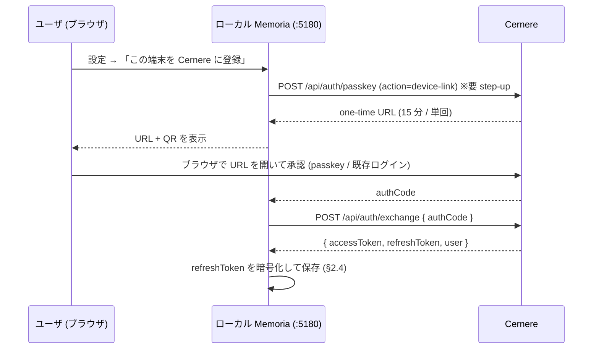

# hub-sync — ローカル Cernere 認証 + Hub からの差分同期 + 表示ソース選択

> neco 指示 (2026-07-31) の 4 要件 + 2 制約を満たす設計。
> **現行 [`multi-hub.md`](./multi-hub.md) の「ローカルは Cernere を知らない」「Multi モードは
> Hub へ proxy」 を意図的に反転させる**ので、 §7 に差分と移行を明記する。
> 関連: [`hub-social.md`](./hub-social.md) / [`hub-achievements.md`](./hub-achievements.md) /
> schema: [`../data/hub-sync.md`](../data/hub-sync.md) / API: [`../interface/hub-sync.md`](../interface/hub-sync.md)

## 0. 要件

| # | 要件 |
|---|---|
| 1 | ローカルで動く Memoria に **Cernere 認証口 (バイパスルート)** を持たせる |
| 2 | (1) で **自動ログイン** |
| 3 | ログインしているサーバの情報を取得して同期。**差分とバージョン**のアプローチで更新。**初回取得は分割**して受け取る |
| 4 | ローカルで **どのサーバの情報を出すか選択** |

| 制約 |
|---|
| 情報は **自動では push されない** |
| **push 先は選べる** |

## 1. なぜ現行設計を反転させるのか

現行 multi-hub は「ログイン先を Hub にする。 ローカルは Cernere を一切知らない」
(§5.2) で、 Multi モードは「ローカル backend が Hub へ proxy」 (§5.3) だった。
要件 1-4 はこの 2 点と両立しない。

- **複数 Hub を同時に見る** (要件 4) と、 Hub ごとに email/password を渡すことになる。
  資格情報の複製が Hub の数だけ増える
- **無人での再認証** (要件 2) が要る。 password を保持し続けるのは筋が悪い
- **差分同期** (要件 3) は「ローカルに持つ」 が前提。 proxy モデルは
  オンラインでしか読めず、 同期する対象がそもそも無い

→ **ローカルが Cernere の一次的な認証主体になる**。 Hub は「project-token を
検証してデータを出す」 だけの役に戻る (= LUDIARS の他サービスと同じ扱い)。

## 2. 要件 1: ローカルの Cernere 認証口 (バイパスルート)

### 2.1 「バイパス」 の意味

ブラウザ対話を毎回挟まない、 という意味。 **認証を弱める意味ではない**。
1 回だけ人間が承認し、 以後は無人で更新できる資格情報をローカルが持つ。

Cernere に既にある部品で組む (新規の認証方式は作らない):

| 部品 | 役割 |
|---|---|
| device-link (`passkey-handler.ts`) | ログイン済み端末が発行する one-time URL。 32byte token / SHA-256 digest のみ Redis / 15 分 TTL / 単回 |
| `POST /api/auth/exchange` | authCode → access/refresh token |
| `POST /api/auth/refresh` | refresh token → 新しい access token (**無人**) |
| `POST /api/auth/project-token` | per-user × per-project の PASETO。 Hub はこれを HMAC 検証する |

### 2.2 登録 (1 回だけ)



### 2.3 ローカル endpoint (loopback 限定)

| method | path | 用途 |
|---|---|---|
| GET | `/api/auth/cernere/status` | `{ linked, user?, accessExpiresAt?, lastRefreshAt?, lastError? }` |
| POST | `/api/auth/cernere/link/begin` | device-link を発行 → `{ url, qrDataUrl, expiresAt }` |
| POST | `/api/auth/cernere/link/complete` | `{ authCode }` → 資格情報を保存 |
| POST | `/api/auth/cernere/refresh` | 手動更新 (診断用) |
| DELETE | `/api/auth/cernere/link` | ローカルの資格情報を破棄 + Cernere 側 revoke |

**loopback 限定は必須**。 外から叩けると端末登録そのものを奪われる。
既存の `server/lib/local-request.ts` の `isDirectLoopbackRequest()` (agent / personality-export /
spending-log と同じ判定。 Origin 不一致の browser CSRF も弾く) を流用し、 非 loopback は 403。

### 2.4 資格情報の保管

- refresh token は **`app_settings` に平文で置かない**。 OS の資格情報ストア
  (Windows: DPAPI) を第一候補、 使えない環境ではファイル + マシン鍵で暗号化し
  `0600` 相当で保存。 保存先は `<DATA>/credentials/cernere.json.enc`
- access token / project-token は **プロセスメモリのみ** (永続化しない)。
  [[feedback_secret_per_user_memory_only]] と同方針
- ログ・例外・API レスポンスにトークンを出さない

## 3. 要件 2: 自動ログイン

- **起動時**と、 access token の残り寿命が 20% を切った時点で `refresh` する
- 失敗の扱いを分ける (**無言で local-only に落とさない** — coding-conventions §7.1):

| 失敗 | 扱い |
|---|---|
| ネットワーク到達不能 | 指数バックオフで再試行 (最大 10 分間隔)。 状態は `degraded` |
| refresh token 失効 / revoke | 再試行しない。 状態は `unlinked` にして **UI に再登録を要求** |
| Cernere が 5xx | ネットワーク扱い |

- Hub ごとの project-token は、 その Hub に問い合わせる直前に発行してメモリキャッシュ
  (TTL は token の exp に従う)
- 同期スケジューラは `linked` かつ access token 有効なときだけ走る。
  `unlinked` のまま黙って古いデータを見せ続けない (UI に「未接続」 を出す)

## 4. 要件 3: 差分 + バージョンによる同期

### 4.1 なぜ change log が要るか

現行 Hub の行は `updated_at` を持つが、 これだけでは同期に足りない。

- **削除が拾えない** — Hub から消えた行は「差分に出てこない」 のでローカルに残り続ける
- **時刻は単調でない** — 時計のずれ / 同一秒の複数更新で取りこぼす

→ Hub 側に **単調増加する rev を持つ変更ログ**を置く。

```
hub_changes(rev BIGSERIAL PK, type, row_id, op('upsert'|'delete'),
            owner_user_id, changed_at)
```

各 type の CRUD が **同一トランザクションで 1 行書く**。 これが同期の単一情報源になる。

### 4.2 差分取得

```
GET /api/data/changes?since=<rev>&limit=500
→ { changes: [{ rev, type, id, op }], nextSince, headRev }
```

- ローカルは type ごとではなく **Hub ごとに 1 本の rev** を進める (順序が保たれる)。
  カーソルの正本は `hub_servers.delta_rev` ([schema §2](../data/hub-sync.md#2-ローカル-hub_servers))。
  `hub_sync_state.last_rev` は型別の進捗表示用で、 追いかけには使わない。
  したがって `/changes` を **型で絞ってはいけない** (絞ったまま cursor を進めると
  他型の変更を飛ばす)
- `op='delete'` はローカルからも消す (tombstone を尊重)
- `changes` は id だけ返し、 本体は既存の `/api/data/<type>?ids=` でまとめて取る
  (変更ログを太らせない)

### 4.3 初回取得 (分割)

全件を 1 回で受けない。 **スナップショット rev を先に固定**してからページングする。

```
GET /api/data/snapshot?type=<t>&cursor=<c>&limit=200
→ { items, nextCursor, snapshotRev }
```

1. 最初の応答で `snapshotRev` を受け取り、 ローカルに記録
2. `nextCursor` が尽きるまで繰り返す (**中断・再開可能**)
3. 全 type が終わったら `since = snapshotRev` で §4.2 の差分に切り替える

ページング中に起きた変更は差分側で後追いされるので、 **取りこぼしも二重取りも起きない**
(二重取りは upsert なので冪等)。

進捗は `hub_sync_state` に持つ:

```
hub_servers(..., delta_rev)          -- Hub ごとに 1 本の差分カーソル
hub_sync_state(hub_id, type, phase('initial'|'delta'), cursor, snapshot_rev,
               last_rev, last_synced_at, last_error)   -- 型別の進捗
```

UI には「初回同期中 3/8 種別・1,240 件」 のように出す (無言で長時間待たせない)。

### 4.4 同期は pull 専用 = 競合しない

**ローカルで編集した行は push しない限り Hub に出ない** (制約 1)。 したがって
「同じ行をローカルと Hub が同時に編集する」 状況が構造的に発生しない。

同一オブジェクトのローカル版と Hub 版が並んだ場合も **上書きしない**。
`source_hub_id` で別レコードとして保持し、 表示側で束ねる (§5)。
これにより conflict resolution エンジンを持たずに済む。

### 4.5 同期対象

| 対象 | 同期 |
|---|---|
| 共有 8 型 (bookmarks / digs / dictionary / implementation-notes / work-locations / domain-catalog / notes / ai-articles) | ✅ |
| 社会層 (subjects / comments / reactions / renditions) | ✅ 公開分のみ |
| achievements (entries / digests) | ✅ 共有ポリシー通過分のみ |
| dig rooms / contributions | ✅ 参加している room のみ |
| 個人ログ (diary / meals / GPS / visits / activity / weather) | ❌ そもそも Hub に無い |
| notifications / feed | ❌ 同期しない (都度取得。 古い通知を溜めない) |

社会層 / achievements / dig room は **ローカルに受け皿テーブルがまだ無い**
([`hub-social.md`](./hub-social.md) の設計で Hub 専用だったため)。
[schema](../data/hub-sync.md) が定義しているのは共有 8 型ぶんの `source_hub_id` だけなので、
これらは Phase 3 の対象外とし、 受け皿の定義は別途 (§10-6)。

## 5. 要件 4: 表示ソースの選択

- ローカルの各行に `source_hub_id` (NULL = 自分が作った行)
- 現行のモード切替 pill を **ソースセレクタ**に格上げする:
  `🏠 ローカル` / `<Hub A>` / `<Hub B>` / `🌐 すべて`
- **常にローカル DB を読む**。 proxy はしない → **オフラインでも見える**
- `🌐 すべて` は UNION 表示。 重複は canonical key で束ねる:

| 型 | 束ねるキー |
|---|---|
| bookmark | canonical URL ([`hub-social.md`](./hub-social.md) §3.2) |
| note / ai_article / dig room | UUID / (hub, origin_local_id) |
| dictionary | 正規化した term |

束ねた行は「どこにあるか」 のバッジを出す (`🏠` / `Hub A` / 両方)。
**削除はしない** — 同じ URL でも人によってメモが違うため。

## 6. 制約: push は自動でしない / 先を選べる

- **自動 push は存在しない**。 定期ジョブも「終わったら共有」 も作らない
- push は必ず明示操作 (`共有` ボタン / API 呼び出し) で、 **その時に対象 Hub を選ぶ**
- 登録 Hub が複数あるとき、 push 先の既定は **未選択** (誤爆を防ぐ)。
  「前回と同じ」 を既定にしない
- AIノート / achievements は push 前に禁止語スキャンを通る
  ([`hub-social.md`](./hub-social.md) §1.2 / [`hub-achievements.md`](./hub-achievements.md) §4.3)
- push した行はローカルの `hub_pushes` (hub_id + local_id + remote_id + pushed_at、
  [schema §4](../data/hub-sync.md#4-ローカル-hub_pushes)) に記録し、
  取り下げ ([`hub-social.md`](./hub-social.md) §8.1) の対象を特定できるようにする

## 7. 現行 multi-hub.md との差分 (移行)

| 論点 | 現行 (multi-hub.md) | 本書 |
|---|---|---|
| 認証 | Hub に email/password → Hub が Cernere に代理ログイン | **ローカルが Cernere と直接**。 Hub には project-token |
| データアクセス | Multi モード = Hub へ proxy | **常にローカル DB**。 Hub からは同期で入る |
| モード | Local / Multi の排他切替 | **ソースセレクタ** (ローカル / 各 Hub / すべて) |
| 他人のデータ | ローカルに持たない | **ローカルに持つ** (§8) |
| オフライン | Multi 中は不可 | 可 |

移行手順:

1. 本書の認証口 (§2) を足す。 Hub の `/api/auth/login` (代理ログイン) は残す
2. Hub に `hub_changes` + `/changes` + `/snapshot` を足す (既存 `/api/data/*` は不変)
3. ローカルに同期エンジン + `source_hub_id` + `hub_sync_state` を足す
4. ソースセレクタに切り替え。 proxy 層は残したまま feature flag で無効化
5. 安定後に proxy 層と Hub 代理ログインを撤去

## 8. プライバシー観点 (方針転換の明示)

- [`hub-social.md`](./hub-social.md) §9 の **「他人のコメント / いいねをローカル SQLite に
  永続化しない」 を撤回する** (neco 指示 2026-07-31)。 同期の前提が成り立たないため
- 代わりに次を守る:
  - 同期で入る他人のデータは `source_hub_id` 付きで分離保管し、 **自分の行と混ぜない**
  - Hub 側で hide / unshare / purge された行は、 差分の `op='delete'` で
    **ローカルからも消える** (取り下げが伝播する)
  - 同期対象は §4.5 の共有意図があるものだけ。 個人ログは Hub に無いので入りようがない
  - ローカル DB は元々個人データを持つ ([[project_personal_data_rule]] の例外扱い) が、
    **他人のデータが増える**ので、 バックアップ / エクスポート機能の対象範囲を
    見直す必要がある (§10 オープン論点)
- 資格情報は §2.4 のとおり。 refresh token を `app_settings` に置かない

## 9. 実装フェーズ

| Phase | 内容 |
|---|---|
| 1 | ローカル Cernere 認証口 (§2) + 資格情報の暗号化保管 + 自動 refresh (§3) |
| 2 | Hub `hub_changes` + `/api/data/changes` + `/api/data/snapshot` |
| 3 | ローカル同期エンジン (初回分割 → 差分)。 `hub_sync_state` + `source_hub_id` |
| 4 | ソースセレクタ UI (ローカル / 各 Hub / すべて) + 束ね表示 |
| 5 | push 先選択 UI + `hub_pushes` 記録 + 取り下げ連携 |
| 6 | proxy 層の撤去 + Hub 代理ログインの撤去 |

Phase 1-3 で「1 回登録すれば、 以後は勝手に最新が手元に来る」 が成立する。

## 10. オープン論点

1. **Cernere インスタンスが Hub ごとに違う場合** — multi-hub は「拠点ごとに別 Cernere」 を
   許していた。 ローカルが直接認証するなら **Cernere ごとに登録が要る**。
   Hub → Cernere の対応をローカルがどう知るか (Hub の `/api/auth/config` で公開する?)
2. **同期の粒度と頻度** — 常時ポーリングか、 開いたときだけか。 SSE で push 通知を受けるか
3. **ローカル DB の肥大** — 他人のデータが入るので上限・保持期間が要るか
4. **エクスポート範囲** — 自分のデータのエクスポートに他人の同期分を含めない線引き
5. **device-link の step-up 要件** — 現行 device-link は「ログイン済み端末から発行」 が前提。
   初回端末 (まだどこにもログインしていない) はどうするか
6. **社会層 / achievements / dig room のローカル受け皿** — §4.5 で同期対象としたが、
   ローカル SQLite に対応テーブルが無い。 Hub 側 schema をそのまま写すのか、
   表示に要る分だけ持つのか。 Phase 3 では共有 8 型に限定して先送りしている
