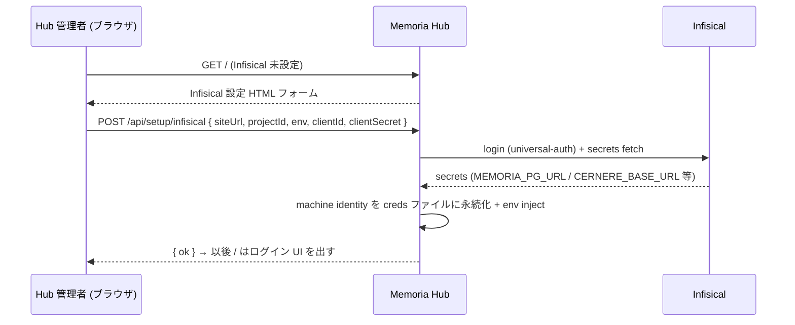
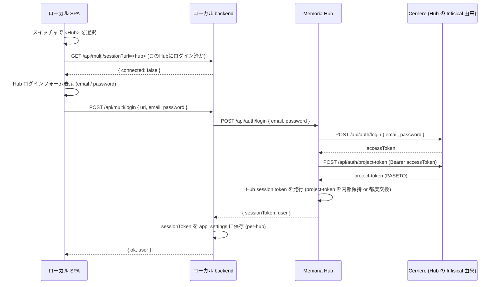
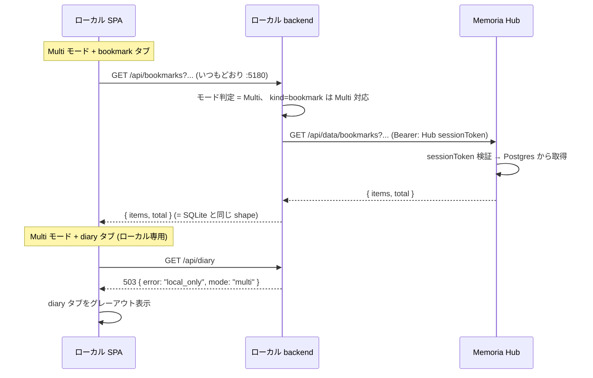

# multi-hub — Memoria Hub (Local / Multi 二層) 設計

> 本ドキュメントは Local / Multi 二層化の **再設計版** (旧 OAuth-dance / share-relay
> 方式を置き換える)。 関連 issue: #34。

## 1. 背景と狙い

### 旧設計の問題
旧 multi-hub は「ローカル Memoria が常に主、 Hub には `/api/shared/*` で個別に
share/download する」 モデルだった。 これだと:

- ログインが **ローカル Memoria → Cernere 直**。 ローカルは `CERNERE_BASE_URL` を
  1 つしか持てず、 **複数拠点の Hub (= 拠点ごとに別 Cernere)** にログインできない。
- Hub の connect が `<hub>/api/auth/start` を叩いていたが Hub に該当 route が無く 404。

### 新設計の狙い
- **ログイン先を Hub にする**。 各 Hub は自分の Infisical を持ち、 自分が属する
  Cernere を知っている。 ローカルは「どの Hub に繋ぐか」 だけ選べばよい。
- **Hub をデータベースハブにする**。 Multi モード時、 ローカル Memoria の
  データアクセス先が Hub の JSON API になる。
- 拠点ごとに Hub を立てられる (= 各 Hub が独立した Cernere + データストア)。

## 2. アーキテクチャ

```
┌─────────────────── ローカル Memoria (個人 PC, :5180) ───────────────────┐
│                                                                          │
│  frontend (SPA)  ──────────►  local backend (Hono + SQLite)              │
│       │                            │                                     │
│   ログ下のスイッチャ:               │  ┌─ Local モード ─┐                 │
│   [🏠 ローカル | <Hub>]            │  │ SQLite 直アクセス │                 │
│                                    │  └─────────────────┘                 │
│                                    │  ┌─ Multi モード ──┐                 │
│                                    │  │ Hub へ proxy ───┼──────────┐      │
│                                    │  └─────────────────┘          │      │
└───────────────────────────────────────────────────────────────────│──────┘
                                                                     │
                          (Bearer: Hub session token)                │
                                                                     ▼
┌─────────────────── Memoria Hub (拠点サーバ, Docker) ────────────────────┐
│                                                                          │
│  UI を持つのは 2 ページだけ:                                               │
│    GET /            → Infisical 設定 + ログイン UI (HTML)                  │
│    それ以外          → JSON のみ (データベースハブ)                         │
│                                                                          │
│  Hub backend (Hono + Postgres)                                           │
│    - Infisical bootstrap (自分の Cernere を知る)                          │
│    - POST /api/auth/login → 内部で Cernere に代理ログイン → session token  │
│    - Multi 対応 7 型の JSON CRUD                                          │
│        │                                                                  │
└────────│──────────────────────────────────────────────────────────────────┘
         │  (代理ログイン: email/password)
         ▼
   Cernere (拠点ごとに別インスタンス可)
```

### コンポーネントの責務

| コンポーネント | 責務 |
|---|---|
| **ローカル frontend** | 常に local backend (`:5180`) に話す。 スイッチャ UI。 Multi 時は Multi 対応タブのみ active |
| **ローカル backend** | Local モード = SQLite 直。 Multi モード = Multi 対応 endpoint を Hub に proxy。 Hub session token を保持 |
| **Hub** | Infisical 設定 UI + ログイン UI の 2 ページ + Multi 対応 7 型の JSON CRUD。 Cernere 代理ログイン |
| **Cernere** | 認証基盤。 Hub が代理でログインする先。 拠点ごとに別でよい |

## 3. Local / Multi スイッチャ

現状トップバーの `#multiSwitch` (pill 列: `🏠 ローカル` + 登録済 Hub) を
**データソース セレクタ** に格上げする。

- pill は **排他選択** (= 同時に 1 つ。 旧 multi-select は廃止)
- `🏠 ローカル` 選択時 = Local モード。 全機能 active、 SQLite 直
- `<Hub>` 選択時 = Multi モード。
  - その Hub に未ログインなら → ログインフロー (§5.2)
  - ログイン済なら → Multi 対応タブのみ active、 データは Hub から
- 切り替えた瞬間にデータソースが確定する (= ページ内の全 load*() が新ソースを見る)

## 4. Multi 対応データ型

| データ型 | Multi 対応 | 理由 |
|---|---|---|
| bookmark | ✅ | 共有して価値がある知識 |
| dig session | ✅ | 同上 |
| dictionary | ✅ | 同上 |
| implementation note | ✅ | 同上 |
| work location | ✅ | 同上 |
| domain catalog | ✅ | サイト辞書 = 共有知識 |
| notes | ✅ | esa 風、 拠点間で共有したい |
| diary | ❌ ローカル専用 | 個人ジャーナル ([個人データ保管禁止]) |
| meals | ❌ ローカル専用 | 個人ログ |
| GPS / tracks | ❌ ローカル専用 | 位置情報 = 個人ログ |
| visits / page_visits | ❌ ローカル専用 | 閲覧履歴 = 個人ログ |
| activity / steam | ❌ ローカル専用 | PC 活動 = 個人ログ |
| weather | ❌ ローカル専用 | 位置紐付き |
| transit rides | ❌ ローカル専用 | 移動記録 = 個人ログ |
| review targets | ❌ ローカル専用 | ローカル git clone を指す |

Multi モード時、 ❌ のタブは **グレーアウト** (= 「この機能は Local モード専用」 と表示)。

## 5. シーケンス

### 5.1 Hub の Infisical 設定 (Hub 初回セットアップ)



### 5.2 ローカルから Hub にログイン



> ポイント: ローカルは **Cernere を一切知らない**。 Hub に email/password を渡すだけ。
> Hub が自分の Infisical で得た `CERNERE_BASE_URL` を使って Cernere に代理ログインする。

### 5.3 Multi モードのデータアクセス (proxy)



## 6. エンドポイント仕様

### 6.1 Hub 側 (新規 / 拡張)

| method | path | 認証 | 説明 |
|---|---|---|---|
| GET | `/` | — | Infisical 未設定 → 設定フォーム / 設定済 → ログイン案内 (HTML) |
| GET | `/api/setup/infisical/status` | — | `{ configured }` |
| POST | `/api/setup/infisical` | — | machine identity を受け取り Infisical 接続 → Hub DB に永続化 |
| POST | `/api/auth/login` | — | `{ email, password }` → Cernere 代理ログイン → `{ sessionToken, user }` |
| GET | `/api/auth/me` | session | `{ userId, displayName, role }` |
| POST | `/api/auth/logout` | session | session 破棄 |
| GET | `/api/data/<type>` | session | Multi 対応 7 型の list (query: limit/offset/filter) |
| GET | `/api/data/<type>/:id` | session | 1 件取得 |
| POST | `/api/data/<type>` | session | 作成 |
| PATCH | `/api/data/<type>/:id` | session | 更新 |
| DELETE | `/api/data/<type>/:id` | session | 削除 |

`<type>` = `bookmarks | digs | dictionary | implementation-notes | work-locations | domain-catalog | notes`。
旧 `/api/shared/*` は移行期間中残し、 Phase 6 で撤去。

### 6.2 ローカル側 (新規 / 変更)

| method | path | 説明 |
|---|---|---|
| GET | `/api/multi/mode` | 現在のモード `{ mode: 'local' \| 'multi', hubUrl? }` |
| POST | `/api/multi/mode` | `{ mode, url? }` — スイッチャ切替。 Multi で未ログインなら `{ needs_login: true }` |
| GET | `/api/multi/session?url=` | 指定 Hub にログイン済か `{ connected, user? }` |
| POST | `/api/multi/login` | `{ url, email, password }` → Hub にログイン → sessionToken 保存 |
| POST | `/api/multi/logout` | `{ url? }` → Hub session 破棄 |

**proxy 層**: Local backend は Multi モード時、 Multi 対応 7 型の既存 endpoint
(`/api/bookmarks` 等) を Hub の `/api/data/*` に転送する。 ローカル専用型の
endpoint は Multi モード時 `503 { error: 'local_only' }`。

旧 `/api/multi/connect` `/api/multi/finish` `/api/multi/proxy/*` `/api/multi/share`
`/api/multi/download` は Phase 6 で撤去。

## 7. 実装フェーズ

| Phase | 内容 |
|---|---|
| 1 | Hub に Infisical bootstrap + `/` 設定 UI (`server/multi/`) |
| 2 | Hub に `/api/auth/login` (Cernere 代理) + session token + ログイン UI |
| 3 | Hub に Multi 対応 7 型の JSON CRUD (`/api/data/*`)。 Postgres スキーマ拡張 |
| 4 | Local backend の mode 状態 + proxy 層。 Multi 時に 7 型を Hub に転送 |
| 5 | Local frontend — スイッチャを排他選択化、 Multi 対応タブのみ active |
| 6 | cleanup — 旧 `/api/multi/{connect,finish,proxy,share,download}` + `/api/shared/*` 撤去 |

各フェーズ完了で commit + 動作確認。

## 8. プライバシー観点

- **個人ログ (diary/meals/GPS/visits/activity/weather/transit) は Hub に出さない**。
  Multi モードでもこれらは触れない (タブがグレーアウト)。
- Hub に出るのは共有意図のある 7 型のみ。 各レコードに `owner_user_id` を持ち、
  「誰のものか」 を追跡。
- ローカルの `app_settings` に Hub ごとの session token を保持 (per-hub、 memory より
  永続。 ただし Cernere accessToken そのものは Hub 側に留まりローカルには来ない)。
- Hub の machine identity (Infisical creds) は Hub のローカル creds ファイルに
  保存 (gitignore 済)、 ローカルには出さない。 アプリ設定値 (MEMORIA_PG_URL /
  CERNERE_BASE_URL 等) は Infra 系も含め全部 Infisical 本体に置く — Postgres に
  creds を置くと PG_URL 取得との循環依存になるためファイルにする。

## 9. 移行と後方互換

- 旧 `/api/shared/*` は Phase 1-5 の間そのまま残す (= 既存接続が即死しない)。
- `app_settings.multi_servers` の構造は流用 (jwt フィールドを Hub sessionToken に転用)。
- Phase 6 で旧経路を一括撤去。 その時点で `cernere-session.ts` のローカル直 Cernere
  経路も不要になる (Cernere はもう Hub だけが知る)。
